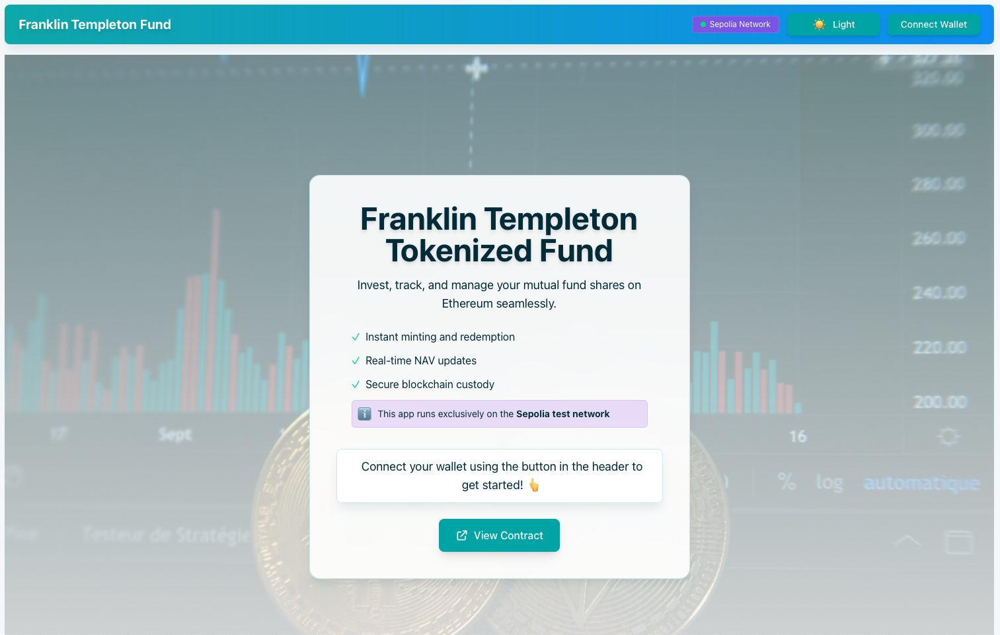
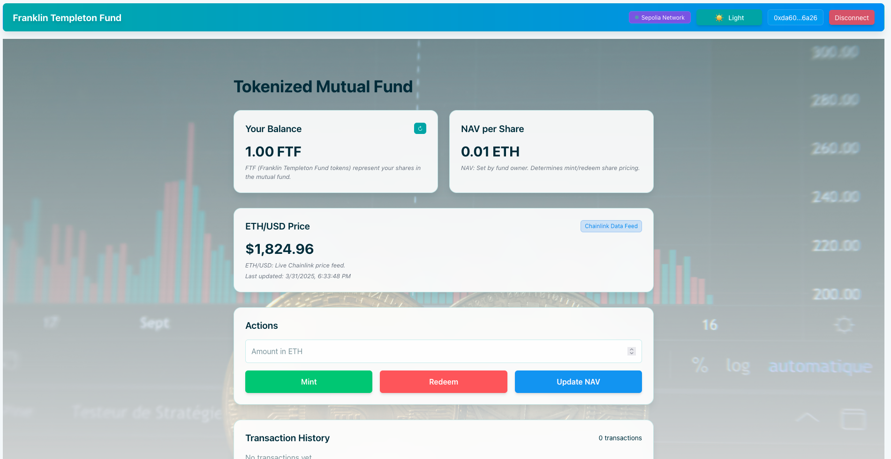

# Tokenized Mutual Fund Application

A decentralized application (dApp) that enables users to invest in and manage a tokenized mutual fund on the Ethereum blockchain. This project demonstrates how traditional mutual funds can be represented as tokens on the blockchain, enabling instant transactions, transparent auditing, and seamless integration with Web3 technologies.

## Contract Details

- **Contract Address (Sepolia)**: `0x884D9173b59C29EAB67c035604b9198DA3a9FfaB`
- **Token Symbol**: FTF (Franklin Templeton Fund)
- **Token Standard**: ERC-20

## 📸 Screenshots

### Landing Page


### Dashboard View


## Features

- **Tokenized Shares**: FTF tokens represent shares in the mutual fund, with value directly tied to the NAV
- **Instant Minting**: Send ETH to mint fund shares automatically based on current NAV
- **Seamless Redemption**: Redeem fund shares for ETH at any time
- **NAV Updates**: Fund manager (contract owner) can update the Net Asset Value
- **Price Feed Integration**: Uses Chainlink ETH/USD price feed for real-time pricing data
- **Emergency Recovery**: Protected functions for handling unexpected situations

## Installation

1. Clone the repository:
```bash
git clone https://github.com/yourusername/tokenized-mutual-fund-app.git
cd tokenized-mutual-fund-app
```

2. Install and run the frontend:
```bash
cd frontend
yarn install
yarn dev
```

## Technical Architecture

The application consists of:

- **Smart Contract**: Written in Solidity, using OpenZeppelin libraries for security and standardization
- **Frontend**: React/TypeScript with Tailwind CSS for styling
- **Web3 Integration**: Uses Wagmi/Viem for blockchain interaction

## Security Features

- **Pausable**: Contract can be paused in emergencies
- **Reentrancy Guard**: Protection against reentrancy attacks
- **Access Control**: Owner-only functions for administrative tasks
- **Emergency Recovery**: Functions to recover assets in case of issues

## Chainlink Integration

The application uses Chainlink's ETH/USD price feed on Sepolia (`0x694AA1769357215DE4FAC081bf1f309aDC325306`) to provide real-time price data. This enables:

- Accurate NAV calculation
- Real-time market prices in the UI
- Automated price-based actions

## FTF Tokens

FTF tokens represent shares in the Franklin Templeton Fund. Each token:

- Is priced according to the current NAV (Net Asset Value)
- Can be minted by investing ETH
- Can be redeemed for ETH at the current NAV
- Represents fractional ownership in the fund's assets

## Development Stack

- **Foundry**: For smart contract development and testing
- **Vite**: For frontend development
- **Wagmi/Viem**: For Web3 interactions
- **Tailwind CSS**: For styling
- **Ethers.js**: For additional Ethereum utilities

---

##  Compliance Note

To ensure real-world regulatory compliance, this proof of concept would require integration with a KYC (Know Your Customer) system or whitelisting mechanism. This would restrict access to minting and redeeming FTF tokens to only verified, eligible investors—aligning the application with financial regulatory frameworks common in mutual fund management.

---

##  Test Suite

This project includes a full-featured Foundry test suite that validates smart contract behavior:

- `test/TokenizedMutualFund.t.sol` covers:
  - ✅ Minting and redemption logic
  - ✅ NAV updates by the contract owner
  - ✅ ETH recovery via the emergency function
  - ✅ Role-based access control and edge cases
- Chainlink integration is unit tested using:
  - ✅ `MockV3Aggregator.sol` for price feed emulation
- Edge case handling includes:
  - Redemptions with zero NAV
  - Unauthorized function access
  - Attempted over-redemption scenarios

To run tests:

```bash
forge test
```

---

## License

MIT

